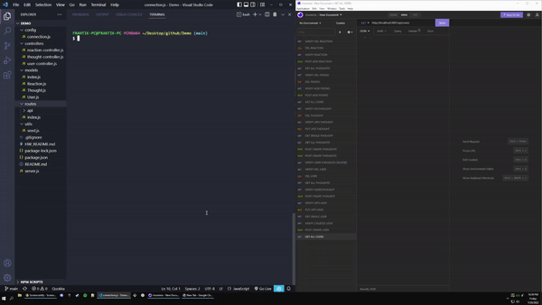
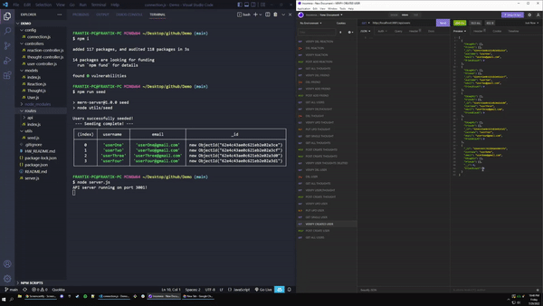

# 18-NoSQL-Social-Network-API

## Table of Contents 📑
- [Description](#description)
- [Application Preview](#application-preview)
- [Installation](#installation)
- [Usage](#usage)
- [Links](#links)
- [Criteria](#criteria)
- [Technologies](#technologies)
- [Questions](#questions)
- [License](#license)

## Description
- API for a social network web application where users can share their thoughts, react to friends’ thoughts, and create a friend list.

## Application Preview

    

    

## Installation
- Copy the repository to your system
- npm install
- npm run seed
- node server.js

## Usage
- This application will allow users to share their thoughts, react to friends’ thoughts, and create a friend list with a NoSQL Database, MongoDB.

## Links
-   Github Repository:
    - https://github.com/brianalegre/18-NoSQL-Social-Network-API
-   Video Demo (YouTube):
    - https://youtu.be/s2GLD1f1Lmo
-   Video Demo (Github):
    - https://github.com/brianalegre/18-NoSQL-Social-Network-API/blob/main/assets/images/SocialMediaAPIDemo.mp4

## Criteria
- Create seed data
- Walkthrough video Demo
- API Routes
    - GET
    - POST
    - PUT
    - DELETE
- Able to Create, Update, and Delete Users, Thoughts, in the database
    - POST, PUT, DELETE Routes
- Able to Create, and Delete Reactions in the database
    - POST, DELETE Routes

- Models
    - User
        - friendCount (virtual)
    - Thought
        - reactionCount (virtual)
    - Reaction (Schema Only)
        - subDocument for the Thought Model
    
- Bonus
    - Remove a user's associated thoughts when deleted

## Technologies
- Express.js
- Node.js
- MongoDB
- Mongoose ODM

## Questions
Questions? Concerns?  Contact Me Below:
- Github Username: brianalegre
- Github Link: https://github.com/brianalegre 
- Email: brialegre@yahoo.com

## License
- Copyright 2022 Brian Alegre
- Licensed under the: [MIT License](https://opensource.org/licenses/MIT) 

